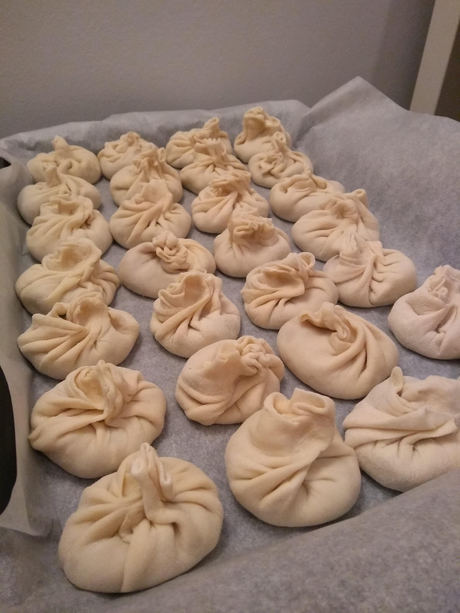
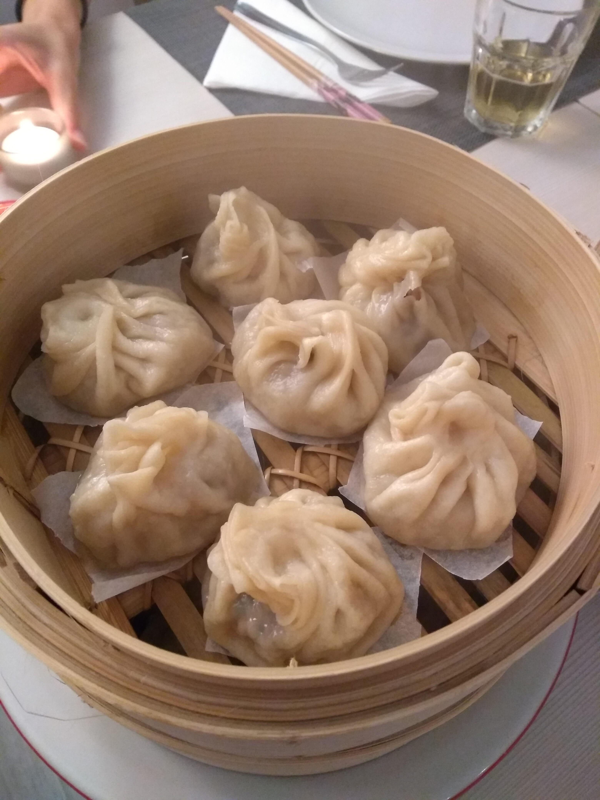

# Baozi (ravioli al vapore ripieni di carne e verdure)

## Ingredienti

**Impasto**

* 400 g **farina 00**
* 250 ml acqua
* 5 g **lievito di birra** fresco

**Ripieno**

* 450 g **carne macinata** (preferibilmente di maiale, in alternativa va bene anche mista o di manzo)
* 2 **pak choi** (cavoli cinesi) di medie dimensioni, triturati finemente
* 3 cucchiai **salsa di soia**
* 2-3 cucchiaini **zenzero fresco** grattugiato
* 3 cucchiai **olio di sesamo**
* 3-4 cucchiai **amido di mais**
* 4-5 **cipollotti** triturati
* 1 cucchiaino sale
* 1 bustina di zucchero
* 40 ml (o meno) di acqua

#### Utensili aggiuntivi necessari

* Vaporiera di bamboo  
  Prima di acquistare una vaporiera sarebbe meglio accertarsi di possedere **o** una pentola alta ("da pastasciutta") con diametro <u>uguale</u> alla vaporiera in questione **o** una padella (meglio se un wok) di diametro <u>superiore</u> a quello della vaporiera
* Mattarello tradizionale o cinese

## Preparazione

### Impasto

Mettere 250 ml di acqua in una ciotolina e sciogliere bene il lievito. Mettere in una ciotola la farina ed unire l'acqua. Impastare finché l'impasto è liscio ed elastico. Mettere a riposare in una ciotola coperta con della pellicola trasparente ed uno straccio per almeno un'ora

### Ripieno

Mettere la carne macinata in una ciotola ed aggiungere poco alla volta tutti gli ingredienti

Terminare aggiungendo molto lentamente <u>fino a</u> 40 ml di acqua (anche meno, finché il composto risultante sia morbido ma non troppo liquido)

Il ripieno può anche essere preparato in anticipo e messo in frigorifero per qualche ora prima di essere usato

### Composizione

Prendere l'impasto e dividerlo in palline di circa 18 g. Con il mattarello stendere le palline (infarinate leggermente per aiutare) creando dei dischetti di circa 8 cm (idealmente più spessi al centro, meno sui lati, si può vedere la tecnica usata cercando video online)

Per ogni dischetto creato, prendere un cucchiaio colmo di ripieno e posizionarlo al centro. Chiuderlo con la [tecnica di chiusura per i baozi](https://youtu.be/qvOBLYVWPYY?t=433) e posizionarlo su una teglia infarinata o con della carta forno (per evitare che si attacchi). Ripetere la procedura per creare tutti i ravioli

Se i ravioli non vengono subito cotti, possono essere conservati in frigorifero per qualche ora

### Cottura

Mettere dell'acqua a bollire in una pentola con diametro uguale a quello della vaporiera di bamboo  
Nel frattempo posizionare i ravioli nella vaporiera, appoggiandoli su quadratini di carta forno precedentemente ritagliati, per evitare che si attacchino durante la cottura 

Quando l'acqua bolle, posizionare la vaporiera con all'interno i ravioli sulla pentola, abbassare la fiamma (medio-bassa) ed impostare un timer di 18 minuti. Al termine, rimuovere la vaporiera dalla pentola ed estrarre i ravioli pronti per essere mangiati

___

#### Conservazione dei ravioli crudi in freezer

I ravioli possono essere preparati in anticipo ed essere congelati (meglio se singolarmente, appoggiati su quadratini di carta forno appoggiati in piano nel freezer per mezz'oretta e successivamente spostati in una busta di plastica)

Per la cottura, <u>non è necessario scongelarli</u> in precedenza. Basta preparare la vaporiera con i ravioli ancora congelati e cuocerli come indicato nella sezione **Cottura** per un tempo leggermente superiore (20 minuti) 