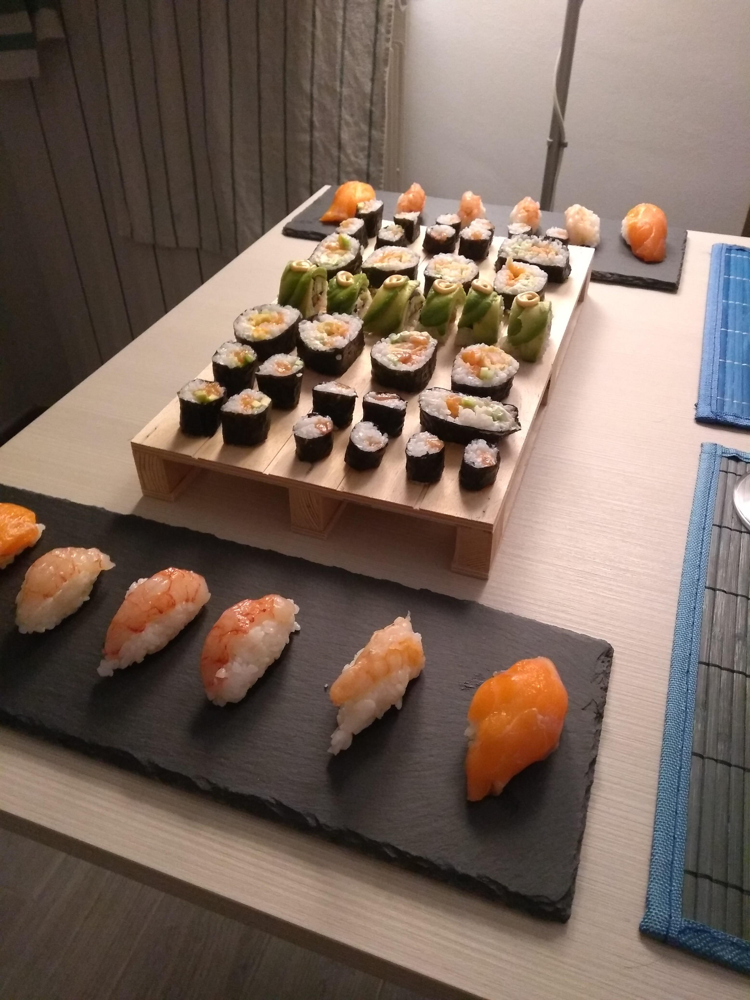

# Sushi (nigiri, hosomaki, uramaki, futomatki, temaki)

 

## Ingredienti

**Riso**

* 500g **riso per sushi** (in alternativa, riso originario)
* 70ml **aceto di riso**
* 600ml acqua
* 60g zucchero
* 20g sale

**Alghe**

* 10 fogli (25 g) di **alga nori** per sushi

**Pesce ed ingredienti aggiuntivi (a piacere, tutti od alcuni di questi)**

* Salmone o tonno abbattuto (per consumo da crudo*)
* Mazzancolle/gamberi (da utilizzare previa cottura, bolliti o fritti)
  * (Opzionale) Panko o pastella generica per il fritto 
* Gamberi rossi (per il consumo da crudo*)
* Philadelphia
* Cetriolo
* Avocado

**Salse a guarnizione o contorno**

* Sriracha (salsa piccante)
* Salsa di soia

(* *Meglio acquistare in pescheria il pesce da consumare crudo, richiedendone esplicitamente l'abbattimento*)

#### Utensili aggiuntivi necessari

* Stuoiette per sushi roll
* Teglia, ciotola o contenitore di legno per lasciar riposare e raffreddare il riso
* Ventaglio

## Prepararsi psicologicamente

### Step complessi

1. **Preparazione e cottura del riso**

   L'intera preparazione richiede tempistiche e procedimenti da seguire con precisione. Inoltre, è necessario "tararsi" per capire come modificare e migliorare la ricetta a seconda dei propri utensili (pentola usata per il riso) e gusti personali (riso più o meno dolce o "acetoso")

2. **Assemblaggio del sushi e dei roll**

   L'unico modo per ottenere dei buoni risultati è la pratica: la prima volta che si prepara del sushi è normale non ottenere risultati eccelsi. Guardare video online può essere un ottimo metodo per capire nel dettaglio le varie fasi e le operazioni da effettuare

   Per la prima volta, si sconsiglia di preparare nigiri e roll semplici (hosomaki/futomaki) senza ingredienti particolari

### Tempistiche

Il riso durante la cottura non deve essere seguito particolarmente. L'intero processo occupa circa <u>40 minuti</u>

Una volta che il riso è pronto va utilizzato il prima possibile. Si consiglia di preparare il pesce e gli ingredienti che verranno utilizzati per il sushi mentre il riso cuoce

Da quando il sushi è pronto, andrebbe mangiato il prima possibile ed a temperatura ambiente. È <u>fortemente sconsigliato</u> conservarlo in frigorifero per poi consumarlo in seguito. Meglio prepararlo in più tempi, alternando preparazione e pasto, o in alternativa prepararlo tutto poco prima di mangiare e poi mettersi direttamente a tavola

### Dosi

Le dosi riportate nella sezioni **Ingredienti** servono per preparare circa un centinaio di singoli roll e una ventina di nigiri, ma dipendono dal tipo di roll fatti. Inoltre, è pressoché impossibile convertire la dose per numero di persone, in quanto dipende dall'appetito e dalle aspettative. Occorre provare e sperimentare per poi regolarsi le volte successive

* Per il **pesce**, se si utilizzano solamente salmone e mazzancolle (niente tonno, niente gamberi crudi), una quantità ragionevole può essere 300 g di salmone e 25-30 mazzancolle

* Per i **roll**, si consideri che con **un foglio** di alga nori **intero** si può ottenere uno fra i seguenti risultati:
  * 12 hosomaki (piccoli roll con alga esterna e 1-2 ingredienti all'interno)
  * 12 uramaki (piccoli roll con alga interna e 1-2 ingredienti all'interno, tipicamente guarniti sopra con semi, salse od altro)
  * 8 futomaki (grandi roll con alga esterna e molti ingredienti all'interno)
  * 2 temaki (coni di riso ed ingredienti vari)
  
  (Queste dosi non sono scolpite nella pietra: ad esempio, volendo, da mezzo foglio di alga si possono ottenere 16 hosomaki)
* Per preparare un **nigiri**, è sufficiente una pallina di riso (cotto) e un pezzo tagliato sottile di pesce

## Preparazione degli ingredienti

### Preparazione del riso

**Lavaggio**  
Lavare il riso a lungo in una ciotola con dell'acqua di rubinetto. La prima volta il riso non va toccato con le mani. Dalle volte successive si continua a riempire la ciotola di acqua (senza far entrare a contatto il getto d'acqua direttamente con il riso) e si sciacqua finché l'acqua non rimane trasparente (o, in alternativa, dopo 10 minuti di lavaggio)  
È un processo estremamente lungo ma importante. Quando l'acqua rimane trasparente, scolare il riso in un colapasta e lasciare a scolare per 15 minuti

**Scelta della pentola e cottura**  
La pentola da utilizzare deve essere <u>non antiaderente</u> e di dimensioni medio-piccole. Per 500 g di riso, un pentolino di diametro 20 cm ed alta 10 cm è sufficiente  

* Dopo che il riso scolato ha riposato per 15 minuti, spostarlo nella pentola, aggiungere l'acqua, <u>coprire con un coperchio</u> e mettere sul fuoco (un fornello di dimensioni medie) con la <u>fiamma al massimo</u>
* Da questo momento in poi **il coperchio non va mai alzato**
* Tenere sotto controllo ed **appena inizia a bollire** (fumo che fuoriesce dal coperchio) abbassare la <u>fiamma al minimo</u> e fare cuocere per **esattamente** 12 minuti (mettere un timer)
* Trascorso questo tempo alzare la <u>fiamma al massimo</u> per **15 secondi** e poi spegnere il fuoco. Lasciare per 15 minuti a riposare (sempre senza alzare il coperchio)

**Preparazione del condimento**  
Mettere in un pentolino aceto di riso, zucchero e sale e cuocere a fiamma bassa finché zucchero e sale non sono completamente sciolti

**Riposo del riso**  

* Far scendere il riso dalla pentola dentro un grande contenitore largo (meglio se contenitore di legno in stile giapponese) aiutandosi con un cucchiaio o una spatola. <u>Non "grattare" il fondo della pentola</u>: è normale che ci sia del riso attaccato sul fondo, che va ignorato e buttato via
* Prendere il condimento all'aceto di riso precedentemente preparato (ancora tiepido/caldo) e farlo "colare" delicatamente sul riso non direttamente, ma facendolo cadere prima su un utensile da cucina o un cucchiaio di legno. Nel mentre, sventagliare il riso con un ventaglio e girarlo con un cucchiaio in modo che il condimento tocchi tutto il riso e che quest'ultimo si raffreddi fino ad arrivare a temperatura ambiente
* Coprire il riso completamente con un canovaccio umido (messo sotto acqua calda e strizzato). Il riso è ora pronto per essere utilizzato

### Pesce ed altri ingredienti

#### Salmone/tonno

* Per i **roll** il pesce va preparato in lunghe striscioline lunghe quanto le alghe, a sezione quadrata (5 mm circa)
* Per i **nigiri** il pesce va tagliato in un modo particolare, si faccia riferimento a [questo video](https://www.youtube.com/watch?v=NVgBnUcJ0LI)

Dipendentemente dagli altri ingredienti scelti, seguire le opportune preparazioni indicate di seguito:

#### Mazzancolle/gamberi

* **Bolliti**  
  Le mazzancolle vanno bollite dopo essere state sgusciate e dopo aver infilato in ognuna di esse un bastoncino da spiedini nella parte superiore del corpo, in corrispondenza della "vena", in modo che durante la cottura rimangano dritti e che non riprendano la loro forma curva  
  I gamberi bolliti possono essere utilizzati sia all'interno dei roll (così come sono dopo la cottura, rimuovendo la coda) che nei nigiri (in questo caso vanno tagliati "a libro" nello stesso modo descritto nella sezione **Gamberi rossi**)
* **Fritti**  
  Prima della frittura è necessario effettuare una manipolazione sulle mazzancolle, per farle rimanere dritte durante la cottura. Personalmente faccio dei piccoli tagli sulla parte superiore e le faccio "scrocchiare" (metodo visibile in [questo video, al momento visualizzato](https://youtu.be/ulqOKya7SVQ?t=288)). Friggere le mazzancolle all'ultimo, poco prima di iniziare ad assemblare il sushi, utilizzando una miscela di pastella pronta asiatica o panko e farina in olio di semi (di girasole), finché non sono ben dorate  
  I gamberi fritti sono tipicamente usati così come sono all'interno dei roll

#### Gamberi rossi (crudi)

I gamberi rossi vanno semplicemente tagliati lungo la metà (lungo il lato inferiore) senza separarli, in modo che siano "aperti a libro" e che possano essere poi adagiati sul riso per farne nigiri. Tipicamente la coda viene lasciata integra e viene poi scartata durante il pasto

#### Avocado

Per utilizzare l'avocado all'interno dei roll è sufficiente tagliarlo per quanto possibile a listarelle. Una possibile alternativa è utilizzarlo come guarnizione sopra gli uramaki, come illustrato in [questo video](https://youtu.be/ENp0r0y78AQ?t=244)

#### Cetriolo

Per utilizzare il cetriolo all'interno dei roll è sufficiente tagliarlo a listarelle. Si può a piacere decidere di lasciare od asportare la buccia secondo i propri gusti

## Composizione

### Preparazione del piano di lavoro

Sul piano di lavoro occorre avere: tutti gli ingredienti pronti all'uso (riso, pesce, ingredienti aggiuntivi), una ciotola di acqua con dentro qualche cucchiaio di aceto di riso per bagnarsi le mani prima di maneggiare il riso, dei canovacci asciutti e abbastanza spazio per lavorare

Se fra i tipi di sushi che si stanno preparando ci sono anche gli uramaki (o semplicemente se si vuole sporcare il meno possibile gli utensili) è possibile rivestire le stuoiette da sushi con pellicola trasparente (ed eventualmente fissarla con dello scotch sul lato che non andrà a contatto con i roll) in modo da evitare che il riso si incolli alla stuoietta o che residui di cibo rimangano appiccicati

Preparare anche un tagliere ed un coltello <u>molto affilato</u> (idealmente uno [Yanagiba](https://en.wikipedia.org/wiki/Yanagi_ba)) per tagliare i roll, che andrà ogni volta bagnato con l'acqua ed aceto preparati in precedenza, e pulito bene dopo ogni taglio

È infine consigliato avere già pronti dei piatti/vassoi/contenitori dove adagiare il sushi una volta pronto

### Preparazione del sushi

Per capire come preparare i vari tipi di sushi il migliore modo è cercare video online per vedere i passaggi necessari. Di seguito viene descritto <u>a grandi linee</u> il procedimento per i vari tipi di sushi. Gli ingredienti usati nei video allegati non sono gli stessi presentati precedentemente, ovviamente possono essere aggiunti a piacere al proprio sushi

(Quando viene indicato di usare meno di un foglio d'alga intera, è sufficiente tagliarlo con le forbici a metà)

#### Hosomaki / futomaki

Accorpo la spiegazione in quanto il procedimento è identico, cambia solo la dimensione dei roll prodotti

Serve **mezzo foglio di alga** per produrre **6** hosomaki; **un foglio di alga** per produrre **8** futomaki

Appoggiare l'alga con la parte ruvida <u>verso l'alto</u>, sulla parte bassa della stuoietta. Bagnarsi le mani con l'acqua e prendere il riso dal contenitore, e stenderlo sull'alga, lasciando libera una striscia di circa 1 cm nella parte alta e premendo leggermente sul riso in modo che aderisca bene  
Aggiungere nella lunghezza gli ingredienti desiderati al centro della zona con il riso. Una volta posizionati, tenendo saldamente la stuoietta ed il centro del roll, arrotolare la stuoietta e premere per dare la forma finale (vedere video proposti)  
Spostare il roll sul tagliere e tagliarlo con decisione a metà. Prendere le metà, appaiarle e tagliarle in terzi per ottenere 6 hosomaki oppure in quarti per ottenere 8 futomaki

<u>Video di riferimento</u>: [hosomaki](https://youtu.be/xsMS4bIq370?t=72), [futomaki](https://www.youtube.com/watch?v=lQnRLOoSYWs)

#### Uramaki

Serve **mezzo foglio di alga** per produrre **6** uramaki

Appoggiare l'alga con la parte ruvida <u>verso il basso</u>, sulla parte bassa della stuoietta. Bagnarsi le mani con l'acqua e prendere il riso dal contenitore, e stenderlo sull'alga, <u>senza lasciare alcuna striscia libera dal riso</u> e premendo leggermente sul riso in modo che aderisca bene. Sollevare l'alga e capovolgerla, in modo che il riso sia a contatto della stuoietta. Aggiungere gli ingredienti a contatto con l'alga, al centro. Una volta posizionati, tenere saldamente la stuoietta e arrotolare il roll, per poi dare la forma finale (vedere video proposti)

<u>Video di riferimento</u>: [uramaki](https://youtu.be/Xp_cheIs9ME?t=34)

#### Temaki

Serve **mezzo foglio di alga** per produrre **1** temaki

La stuoietta non è necessaria. Tenendo l'alga in mano, aggiungere prima il riso e poi gli ingredienti nel primo terzo dell'alga (non lungo tutta l'altezza, vedere video proposti). Arrotolare per ottenere un cono ripieno di riso ed ingredienti

<u>Video di riferimento</u>: [temaki](https://youtu.be/zZMGBxtgulk?t=307)

#### Nigiri

La stuoietta non è necessaria. Prendere il riso e dargli la forma nella mano, aggiungere poi il pezzo di pesce e dare la forma finale al nigiri

<u>Video di riferimento</u>: [nigiri](https://youtu.be/LKJZd1VHsr8?t=81)

## Pasto

Finalmente, preparare in tavola ciotoline con salsa di soia, opzionalmente wasabi e zenzero marinato. Utilizzare bacchette di legno come posate. Buon appetito! :) 