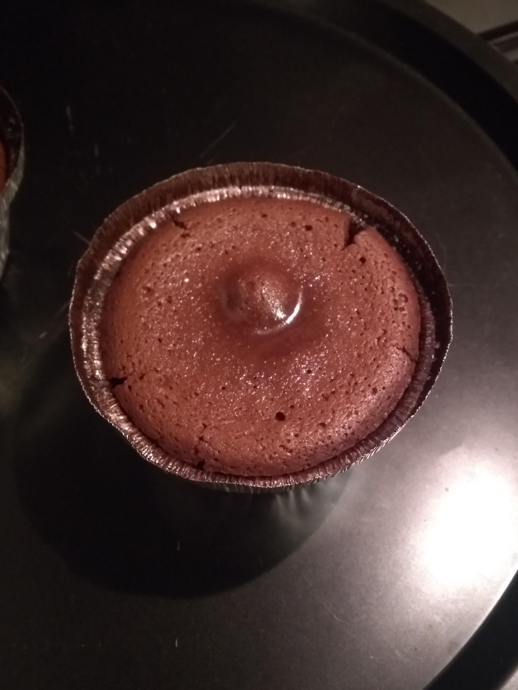
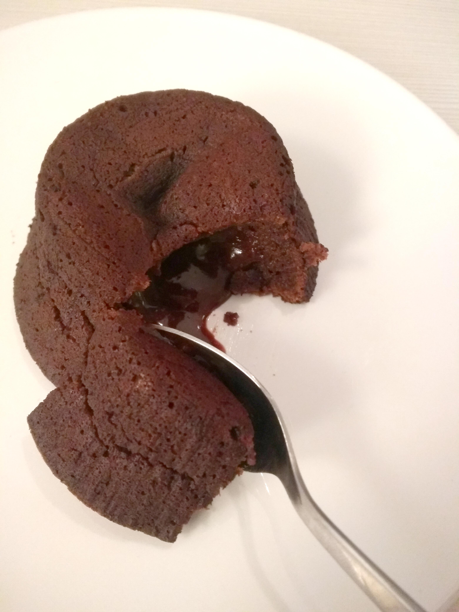

# Tortino al cioccolato (con cuore morbido)

## Ingredienti (per 6 tortini)

**Impasto**

* 150 g **cioccolato fondente**
* 120 g **burro**
* 120 g **zucchero**
* 3 **uova**
* 30 g di **farina 00**
* Cacao amaro
* Zucchero a velo

### Utensili aggiuntivi necessari

* Pirottini di alluminio o contenitori adatti sia al freezer che al forno

## Preparazione

Far sciogliere a fuoco basso in un pentolino burro e cioccolato (tagliato grossolanamente) finchè uniforme. Trasferire il composto in una ciotola. Aggiungere lo zucchero e mescolare con una frusta

Aggiungere le uova (una alla volta, non aggiungerne altre finchè non è completamente amalgamato) e continuare a mescolare. Incorporare infine la farina

Imburrare con attenzione e cospargere di cacao i pirottini. Versare in ogni pirottino il composto fino a circa ⅔

Mettere i pirottini a riposare per 2-3 ore nel freezer, in modo da far congelare lo strato in superficie

## Cottura

Accendere il forno a **200°** (modalità statica) ed infornare i tortini appoggiati su di una teglia

I tortini sono pronti quando la parte superiore è interamente cotta (crosticina interamente formata), ovvero dopo circa 15 minuti. Sfornare i tortini e rovesciarli subito su un piatto, capovolgendoli

Guarnire a piacere con zucchero a velo, cacao od altro e consumare ancora caldi

___

#### Conservazione dei tortini crudi in freezer

I tortini possono essere utilizzati in seguito, congelandoli nel freezer (non per troppo tempo, dato che contengono uova)

Per la cottura, il procedimento è lo stesso indicato sopra, anche i tempi sono indicativamente gli stessi. La discriminante per sfornarli rimane sempre la crosticina superiore, che deve essere "completamente fatta"

___

 

