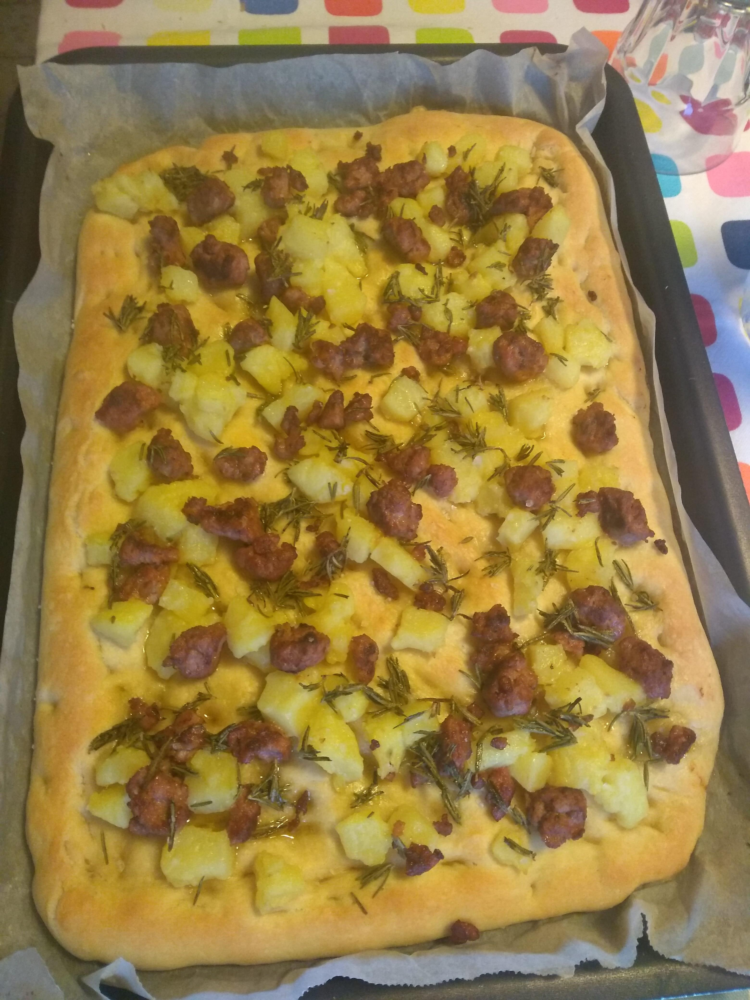

# Focaccia con salsiccia, cipolle, patate e rosmarino

## Ingredienti

**Impasto**

* 500 g **farina** (**00** o **W170**)

* 5 g **lievito di birra** fresco
* 380 ml **acqua**
* 3 cucchiai olio d'oliva
* 2 cucchiaini sale fino

**Condimento**

* 3-4 **patate**
* q.b. **salsiccia**
* 2 **cipolle**
* 2 rametti di **rosmarino**
* **Mozzarella** (opzionale)
* Sale grosso

## Preparazione

### Impasto

Unire lievito di birra ed acqua, mescolare bene e lasciare riposare 5-10 minuti.
Mettere quasi tutta la farina (450g circa) in una ciotola ed aggiungere poco a  poco l'acqua e lievito miscelando con una forchetta lentamente.  Continuare a miscelare nella ciotola, se serve aiutarsi con la spatolina per rimuovere l'impasto appiccicoso dai bordi della ciotola.
Lavorare bene l'impasto con la forchetta per renderlo meno appiccicoso ed infine trasferirlo sulla spianatoia infarinata. Continuare con la spatolina a lavorare ad aggiungere la rimanente farina poco a poco. L'impasto finale sarà molto morbido ma non deve risultare troppo appiccicoso al tatto.  Spostare l'impasto in una ciotola e coprirlo con pellicola trasparente  (lasciando lateralmente buchi per far passare l'aria). Coprire la ciotola con uno straccio e mettere a riposare dalle 5 alle 8 ore.

### Condimento

Preparare in anticipo gli ingredienti per condire la focaccia:

* Rosolare la salsiccia a pezzettini in una padella, asciugando il grasso in eccesso
* Lessare le patate (opzionale: passarle in padella a dadi con un filo d'olio)
* Tagliare le cipolle ad anelli e soffriggerle in padella
* Tritare il rosmarino e metterlo in una ciotolina con un filo d'olio

### Cottura

Dopo il riposo, 30 minuti prima di infornare, stendere l'impasto su una teglia ricoperta di carta forno (meglio ungersi le mani di olio) e fare con le dita molti buchi sulla superficie. In una ciotolina preparare olio e acqua in salamoia in parti uguali e con l'aiuto di un pennello spennellare tutta la superficie della focaccia. Lasciare 30 minuti a riposare.
Riscaldare il forno al massimo (**280°**, in modalità statica) ed infornare la focaccia dopo aver fatto un giro di olio sopra e sale grosso.  Volendo le patate si possono già aggiungere ora (gli altri ingredienti  dopo).
Dopo 10 minuti aggiungere i rimanenti ingredienti e infornare di nuovo per almeno 15-20 minuti. Se serve spostare sul fondo del forno la teglia per rendere la cottura uniforme. Nel caso si voglia aggiungere la mozzarella, farlo a fine cottura e dopo averla asciugata bene, in modo che rimanga in forno pochi minuti e non faccia acqua. Quando anche il fondo della focaccia è ben cotto, sfornare.

___

 

