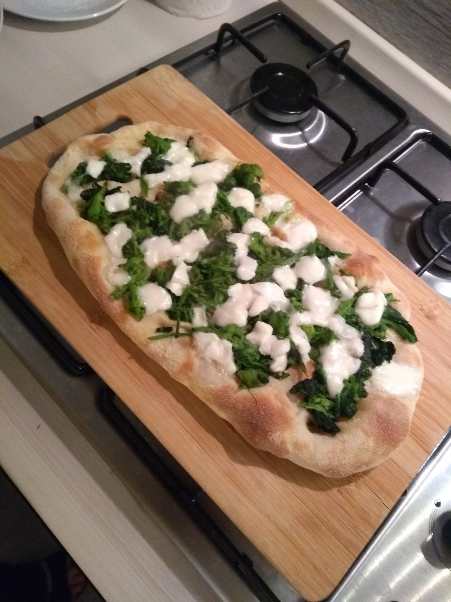
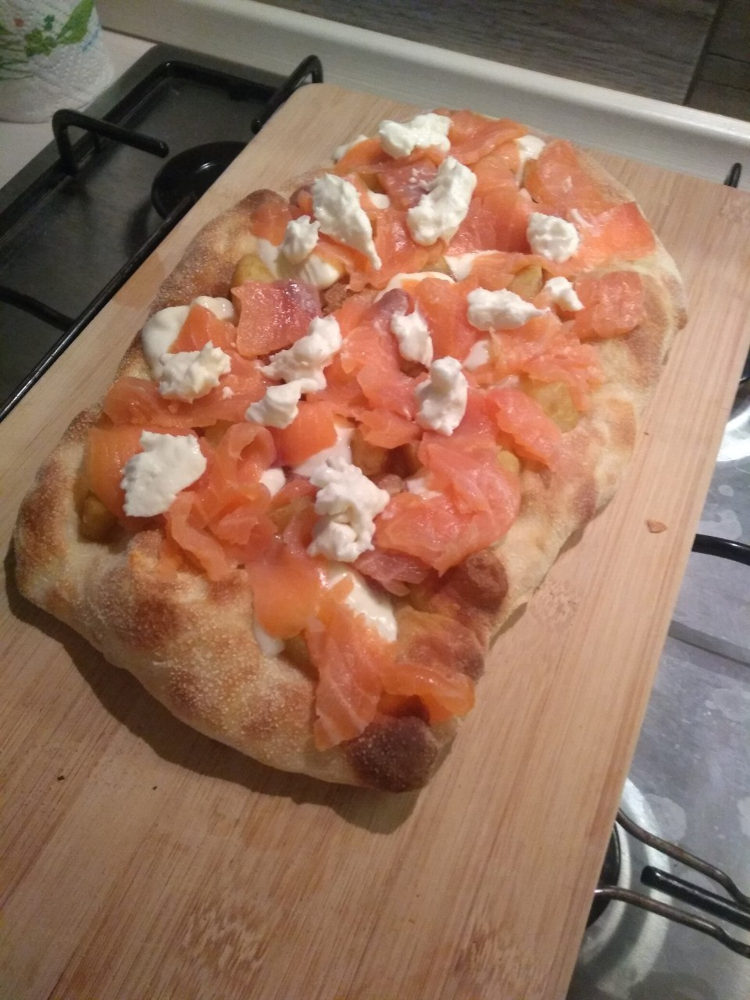

# Pinsa (H 75%)

## Ingredienti

**Impasto (dosi per 3 pinse)**

* 430 g **miscela di farina per pinsa**
* 320 ml **acqua fredda** (da frigo) (divisi in 300+20)
* 3 g **lievito** di birra fresco
* 10 g **sale**
* 10 g **olio**
* **Spolvero** (farina di spolvero di riso o semola di grano duro)

## Preparazione

### Impasto

In una ciotola miscelare la farina, il lievito e 300 ml di acqua fredda (tenendone da parte 20 ml). Mescolare con un cucchiaio e lavorare energicamente sulla spianatoia fino ad ottenere un impasto liscio e compatto

Rimettere l'impasto nella ciotola e tagliarlo in pezzi con un coltello od una forbice

Aggiungere il sale, l'olio ed i 20 ml rimanenti di acqua fredda e fare assorbire l'acqua aggiunta lavorando l'impasto con le mani nella ciotola, per poi lasciare a riposare per 20 minuti in frigorifero (per rendere l'impasto più compatto e facile da lavorare)

Mettere l'impasto sulla spianatoia e piegarlo su se stesso per inglobare aria portando i bordi verso il centro. Quando liscio, spostare in ciotola e chiudere con pellicola

Lasciare riposare a temperatura ambiente fino al raddoppio (circa 3-4 ore)

Spostare la ciotola in frigorifero e lasciare riposare dalle 24 alle 48 ore

### Staglio

Trascorso il tempo in frigorifero si possono subito stagliare i panetti, utilizzando lo spolvero per stendere le palline

Con la mano leggermente umida, prendere l'impasto dalla ciotola e mozzarlo strozzando con l'altra mano. Ogni panetto deve pesare 250 g

I panetti vanno chiusi "unendo i lembi", prima lungo una direzione e poi l'altra. I lembi vanno uniti molto bene, per "sigillare" completamente la parte interna

Messi in una teglia coperta da un panno umido (strizzato con acqua calda) le palline raddoppiano in 2-3 ore (dipendentemente dalla temperatura ambiente)

### Stesura ed infornata

Si appoggia la pallina sullo spolvero, se ne mette anche sopra e si stende con le dita aperte, toccando la pinsa il meno possibile. Si prende in mano e si allarga lungo una direzione in modo che assuma una forma ovale/rettangolare (circa 33x22 cm)

### Cottura

Con forno al massimo (250°) e pietra refrattaria preriscaldata, si stende la pinsa sulla pala, si aggiunge un filo d'olio su di essa e si effettua una **precottura** per poco più di un minuto

Una volta precotta, si estrae dal forno, si aggiungono gli ingredienti e si fa cuocere per 3-4 minuti

<u>[Ricetta ufficiale](https://www.youtube.com/watch?v=5OpKjsYFB5M)</u>

___

 

