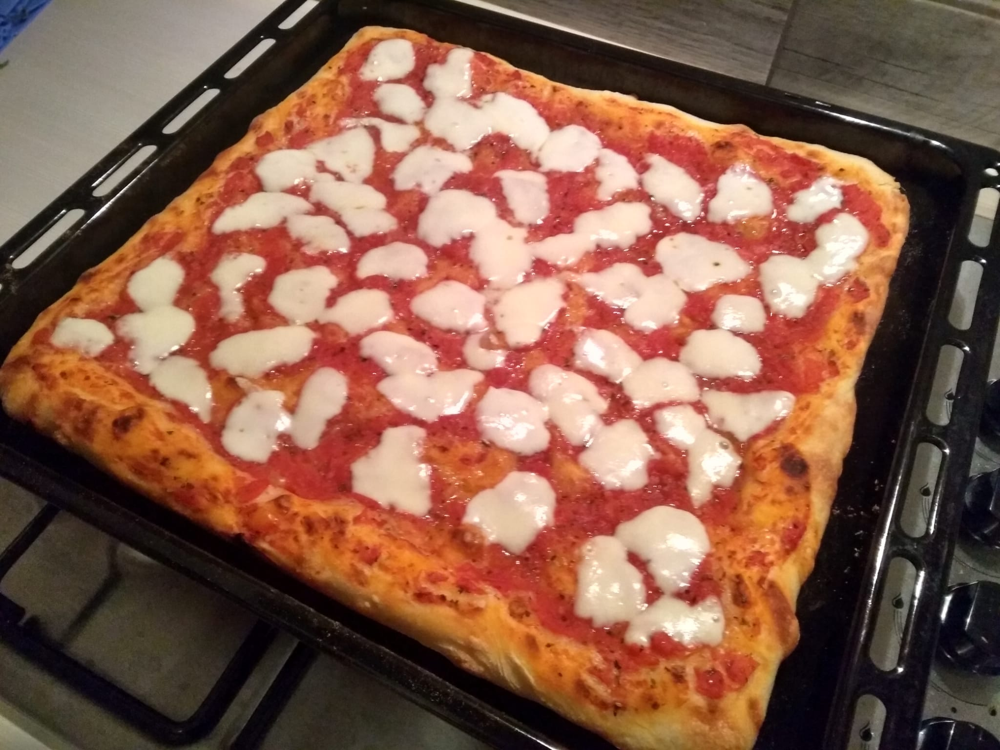

# Pizza in teglia

## Ingredienti

**Impasto**

* 400g **farina** (W180 o tipo 0 o tipo 00)
* 200g **semola di grano duro**
* 450g **acqua**
* **Lievito** di birra fresco (poco, una scaglia da 5g, ¼ di cubetto)
* 2 cucchiai **olio**
* Sale

**Condimento**

* 1 barattolo grosso di passata di pomodoro
* 1-2 mozzarelle
* Olio
* Origano
* Sale

**Sugo (preparare in anticipo)**  
Scolare la passata di pomodoro in un colino a maglie fini in modo che butti fuori l'acqua e metterla in una ciotola. Aggiungere sale, olio ed origano e mescolare

**Mozzarella**  
La mozzarella va tagliata a fettine e lasciata ad asciugare bene su carta da cucina

## Preparazione

### Impasto

Mettere il lievito nell'acqua, mescolare bene. In una ciotola grande aggiungere farina ed olio, aggiungere l'acqua poco alla volta, mescolando sempre con una forchetta finché l'impasto non risulta maneggiabile
Trasferire su spianatoia e lasciare riposare per qualche minuto, per poi iniziare a lavorare la pasta allungandola con le mani e chiudendola su se stessa, inglobando più aria possibile. Inglobare il sale durante questa fase. Se il composto risulta troppo appiccicoso aggiungere poca farina. L'impasto finito deve risultare morbido ed elastico, non va lavorato troppo o rischia di diventare troppo duro

Trasferire l'impasto in una ciotola pulita grossa, oliare leggermente la parte superiore dell'impasto ed i bordi della ciotola. Coprire con un canovaccio leggermente umido o chiudere la ciotola con pellicola trasparente, lasciando una fessura scoperta sul bordo in modo che possa entrare un minimo di aria

Lasciare lievitare in luogo senza correnti d'aria, a temperature ambiente per 5-6 ore. Quando l'impasto è lievitato, trasferirlo in una teglia molto oliata (o in alternativa rivestita di carta forno) e stenderlo senza mai rompere o piegarlo. (Opzionale: lasciare riposare ancora 15-30 minuti per una pizza più soffice). Condire con il sugo preparato in precedenza, olio e sale

### Cottura

Infornare a forno preriscaldato al massimo (280°)

Quando la pizza è quasi cotta aggiungere la mozzarella a fette e rimettere in forno per 3-4 minuti. Se ci sono altri ingredienti vanno aggiunti a piacere ad inizio, metà o fine cottura

Il tempo di cottura complessiva dipende molto dal forno, dai 20 ai 30 minuti circa

___

