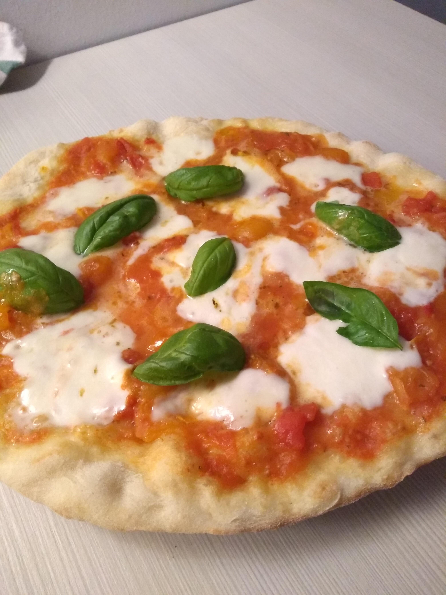

# Pizza napoletana (H 70%)

## Ingredienti

**Impasto**

* Acqua
* Farina (W260 o tipo 0)
* Lievito di birra fresco
* Sale
* Semola di grano duro

#### Dosi per pizze da circa 32 cm

| Panetti risultanti | Farina totale (60:40) [g] | Acqua [ml] | Sale [g] | Lievito [g] |
| ------------------ | ------------------------- | ---------- | -------- | ----------- |
| 1                  | 140 (80+60)               | 100        | 5        | 0.5         |
| 2                  | 280 (170+110)             | 200        | 10       | 1           |
| 3                  | 420 (250+170)             | 300        | 15       | 1.5         |
| 4                  | 560 (340+220)             | 400        | 20       | 2           |
| 5                  | 700 (420+280)             | 500        | 25       | 2.5         |
| 6                  | 840 (500+340)             | 600        | 30       | 3           |

**Condimento**  
_Dosi indicative <u>per 3 panetti</u>_

* 1 barattolo grosso di passata di pomodoro
* 2 mozzarelle
* Olio
* Sale
* Origano (opzionale)
* Foglie di basilico

**Sugo (preparare in anticipo)**  
Scolare la passata di pomodoro in un colino a maglie fini in modo che butti fuori l'acqua e metterla in una ciotola. Aggiungere sale, olio ed origano e mescolare

## Preparazione

### Impasto

Iniziare con una ciotola d'acqua, sciogliere il lievito a mano ed aggiungere il 60% della farina totale (fare riferimento all'ultima colonna della tabella per le dosi già calcolate), mescolare bene e lasciare riposare per 20 minuti

Riprendere l'impasto integrando la restante farina (40% del totale) a manciate (aspettando venga assorbita quella precedente). Quando la massa è lavorabile spostare in spianatoia, inserire il sale e fare 5 minuti di pausa

Riprendere l'impasto cercando di incorporare più aria possibile al suo  interno, facendo delle pieghe per ossigenarlo. Una volta che la massa è compatta e non appiccicosa l'impasto è pronto

Mettere l'impasto in una ciotola di vetro, uno straccio umido sopra l'impasto (a contatto) e della pellicola trasparente a sigillare il tutto. Fare riposare per circa 19 ore in frigorifero (7°)

### Staglio

Riprendere l'impasto e stagliare i panetti inglobando aria al loro interno facendoli "scivolare" sulla spianatoia. Ogni panetto deve pesare circa 240g.  Far lievitare i panetti per circa 5 ore a temperatura ambiente in una teglia leggermente spolverata di semola e ben chiusa con pellicola trasparente

### Composizione ed infornata

Mettere della semola sulla spianatoia. Prendere il panetto ed appoggiarne entrambi i lati sulla semola, per infarinarlo. Stenderlo con premendo con delicatezza con le dita delle mani aperte al centro del panetto, mantenendo il bordo più alto in modo da ottenere un bel cornicione. Stendere il panetto finché non assume una forma circolare di circa 32 centimetri. Spostare la base per la pizza sulla pala leggermente impolverata di semola, trascinandola con decisione dal piano di lavoro

Condire la pizza con il sugo. A seconda della potenza del forno aggiungere già in questa fase la mozzarella (se il forno è in grado di raggiungere temperature fino a 300°C la mozzarella può essere già aggiunta ad inizio cottura, dato che ogni pizza cuoce in pochi minuti). Il mio consiglio è di aggiungere in ogni caso la mozzarella in un secondo tempo, ad un minuto da fine cottura. Preparare in anticipo fettine di mozzarella circolari ed asciugarle bene usando fogli di carta da cucina

### Cottura

La pietra refrattaria va riscaldata in anticipo, mettendola nel forno a forno freddo ed accendendo il forno alla temperatura massima. Dopo mezz'ora è possibile cuocere le pizze, appoggiandole con la pala sulla pietra refrattaria

Il tempo di cottura varia a seconda della temperatura che raggiunge il forno, indicativamente 3-4 minuti per pizza. Sfornarle aiutandosi con una pala larga o la stessa pala da pizza