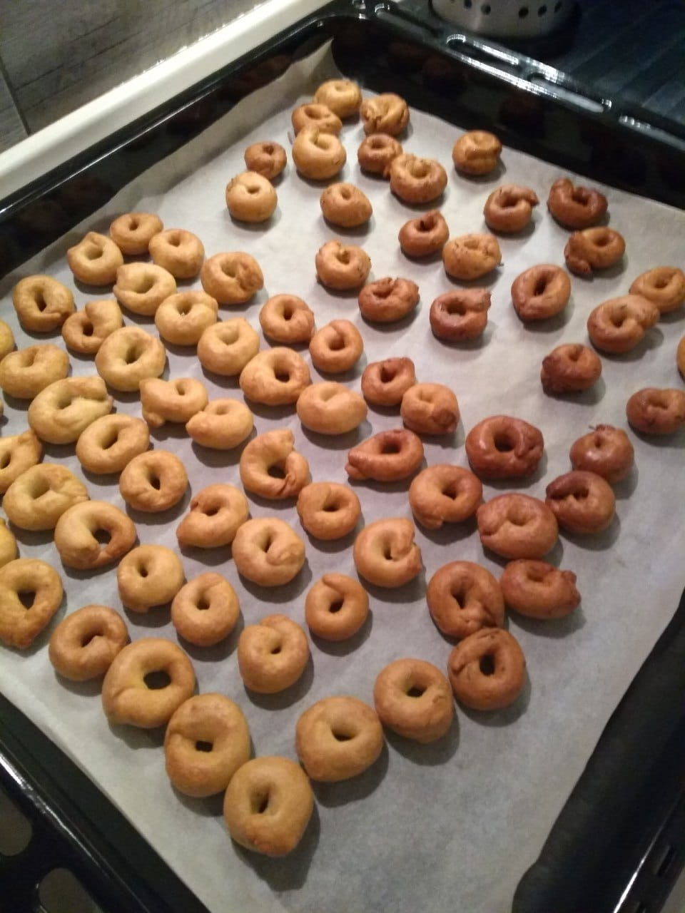

# Taralli

## Ingredienti

**Impasto** (dosi per ~110-120 taralli)

* 500 g **farina 00**
* 125 ml **vino bianco**
* 50 ml **acqua**
* 120 g **olio extravergine d'oliva**
* 10 g di sale (2 cucchiaini)

**Ingredienti aggiuntivi per i taralli**  
_Elenco di possibili idee per diversi gusti_

* Cipolla liofilizzata
* Peperoncino o paprika
* Semi di finocchietto
* Cime di rapa
* Noci a pezzettini
* Olive

## Preparazione

### Impasto

Unire farina, metà del vino, sale e quasi tutto l'olio in una ciotola ed impastare con decisione per qualche minuto, per poi aggiungere il vino rimanente e continuare ad impastare spostandosi in spianatoia, fino a rendere l'impasto il più omogeneo possibile

Dividere l'impasto in panetti (se necessario, per i diversi gusti), aggiungere gli ingredienti aggiuntivi ed inglobarli all'interno impastando, infine aggiungere un po' del rimanente olio ad ogni panetti

Non è necessario alcun riposo prima di procedere con la forma

### Forma

Aiutandosi con una bilancia, dividere i panetti in palline da multipli di 7 g (ad esempio formando palline da ~28 g, da cui si ricaveranno 4 taralli)

Lavorare ogni pallina in modo da ottenere un lungo cilindro, che verrà diviso in questo caso in 4, tenendo presente che ogni tarallo "svolto" dovrebbe essere lungo quanto la larghezza del palmo di una mano

Formare i taralli chiudendo ogni cilindretto su sé stesso e premendo per incollarne le estremità, ottenendo la caratteristica forma

Disporre i taralli formati su delle teglie

### Precottura (bollitura)

Mettere a bollire una larga pentola d'acqua e salarla normalmente

Quando l'acqua bolle, fare bollire (10-15 per volta) i taralli e rimuoverli con una schiumarola non appena salgono a galla, per poi disporli su degli stracci in modo da asciugarli subito

I taralli così precotti devono ora riposare ed asciugarsi il più possibile per almeno 3-4 ore, fino ad una notte intera

Si consiglia di lasciarli su stracci ben asciutti (se necessario sostituire gli stracci quando troppo umidi) ed all'aria (a temperatura ambiente)

### Cottura

Riscaldare il forno a 180°

Disporre i taralli su una teglia rivestita di carta forno e cuocere per circa 45 minuti

___

